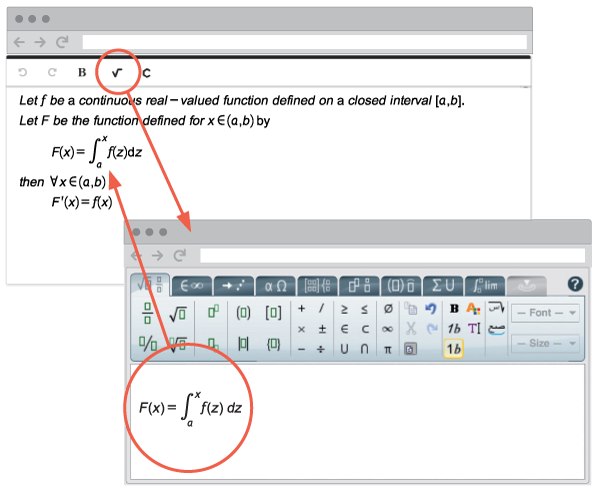

# Mono-repository for the MathType Web plugins and their dependencies. &nbsp;  

[](CONTRIBUITING.md) &nbsp; &nbsp; &nbsp; 
[](CONTRIBUITING.md) &nbsp; &nbsp; &nbsp; 
[](https://github.com/wiris/html-integrations/graphs/traffic)

Mono-repository for the [MathType](http://www.wiris.com/en/mathtype) Web plugins and their dependencies. 



## Table of contents

- [Requirements](#requirements)
- [File Manifest](#file-manifest)
  - [Important files & folder structure](#important-files--folder-structure)
  - [Supported editors](#supported-editors)
- [Quick start](#quick-start)
  - [Cloning](#cloning)
  - [Installation](#installation)
  - [Bootstrapping](#bootstrapping)
  - [Compiling](#compiling)
  - [Batch actions](#batch-actions)
    - [Compiling packages individually](#compiling-packages-individually)
    - [Compile packages by technology](#compile-packages-by-technology)
    - [Cleaning up](#cleaning-up)
  - [Analyzing and fixing code](#analyzing-and-fixing-code)
  - [Versioning](#versioning)
  - [Publishing](#publishing)
- [Examples for developers](#examples-for-developers)
- [More information](#more-information)
- [License](#license)

## Requirements

This project requires basic knowledge of the `git` and `npm` commands.
It also uses the `npx` tool which comes bundled with `npm`.

To install node and npm follow this [guide-npm](https://docs.npmjs.com/downloading-and-installing-node-js-and-npm), and use this other one [guide-git](https://www.atlassian.com/git/tutorials/install-git) to install git.

[Lerna](https://lerna.js.org/) is used as a cornerstone of the project structure. Its main features are explained in this guide.

## File Manifest

### Important files & folder structure

In this section we give a small description of the files that we consider the most important of the project, also we will talk about the content of the subfolders of the project and its usefulness.

- `lerna.json`, `package.json`, `package-lock.json`. Configuration files for the
root npm package and the Lerna mono-repository.
- `packages/`. Each folder contains one npm package. All the usual npm commands
work inside.
- `demos/`. A growing set of technical demos to help developers integrate these plugins on different scenarios.
- `scripts/`. Folder containing different scripts used at compile time, etc.
- `resources`. Folder containing different resources files that are needed in the demos folder.

### Supported editors

In the next list, you will see the editors that have a specialized WIRIS plugin of the mathtype formula editor.

- CKEditor
- Froala
- TinyMCE 
- Generic* 
 
> *: generic is a global integration made so that, from there, the WIRIS plugin can be integrated into any editor by following its steps.

## Quick start

Follow these instructions to use the libraries.

### Cloning

First, clone the repository

#### Linux/Mac

```sh
$ git clone https://github.com/wiris/html-integrations
$ cd html-integrations
html-integrations$
```

#### Windows

You will need to have administrator privileges or activate
[developer mode](https://docs.microsoft.com/en-us/windows/uwp/get-started/enable-your-device-for-development)
in your account, and then use the `core.symlinks` when cloning the repository:

```sh
projects$ git clone --config core.symlinks=true https://github.com/wiris/html-integrations
```

### Installation

After cloning this repo, open a Terminal window to run these next commands:

```sh
$ npm install
$ npm start
```

In case you want to try out the [Technical Demos](#technical-demos) you can go to the **demos** folder and follow the instructions you can find in the folder README file. 

### Bootstrapping

The mono-repository is managed through [Lerna](https://lerna.js.org/), a tool
designed for maintaining multiple npm packages in a single git repository.

Before using Lerna, it is recommended to install the development dependencies
stated in the root `package.json` file as they are used in the scripts of all
packages:

```sh
html-integrations$ npm install
```

### Compiling

It is possible to compile manually all the packages. What this does is try to find
which dependencies of the mono-repo packages are present inside the mono-repo
itself, and link to them instead of downloading them from the npm repository.

```sh
html-integrations$ npm start
```

If this fails, try using `npx`:

```sh
html-integrations$ ./packages/mathtype-ckeditor5/npm pack
html-integrations$ npx lerna bootstrap
```


### Batch actions


#### Compiling packages individually

To try out a single package, it can be compiled individually as such:

```sh
html-integrations/packages/mathtype-[editor]$ npm run compile -- [tech] [--dev]
```

Where [editor] can be any of:

- `ckeditor4`
- `ckeditor5`
- `froala`
- `froala3`
- `generic`
- `tinymce4`
- `tinymce5`

and [tech] can be any of:

- `aspx`
- `java`
- `npm`
- `php`
- `ruby`

The `--dev` optional flag calls the `build-dev` script defined in the plugin's `package.json`
instead of the `build` script.

This replaces the service provider URI and server with the appropriate values,
builds the sources with Webpack, and places the result in
`html-integrations/output/[tech]-[editor]`.

#### Compile packages by technology

Lerna allows to run a single command on all or any packages in the
mono-repository. For example, you can build all editors for a all technologies
like this:

```sh
html-integrations$ npx lerna run compile -- npm
```

#### Cleaning up

Clean the output in the root folder and in the packages:

```sh
html-integrations$ npm run clean
```

Clean the outputs and also all of the `node_modules`:

```sh
html-integrations$ npm run clean-all
```

This will require you to `npm i` and `npm start` in the root again.

### Analyzing and fixing code

There are configuration files at the root of the project to help. They statically analyze and fix code errors in files with extensions .js, .css and .html. The analysis shows the error and where it is, then it can be fixed. The commands are:

* To make a check of the .js files
    ```
    $ npx eslint --quiet [options] <dir|file|glob>*
    ```
* To make a check of the .css files
    ```
    $ npx stylelint [options] <dir|file|glob>*
    ```
* To make a check of the .html files
    ```
    $ html-validate [options] <dir|file|glob>*
    ```
It is possible to automatically fix some of the errors, just add the `--fix` option in the desired command and run it.

### Versioning

In this project [semantic](https://semver.org),
[independent](https://github.com/lerna/lerna#independent-mode) versioning is
used.

The semantic version convention is applied:

> Given a version number MAJOR.MINOR.PATCH, increment the:
>
> 1. MAJOR version when you make incompatible API changes,
> 2. MINOR version when you add functionality in a backwards compatible manner, and
> 3. PATCH version when you make backwards compatible bug fixes.

Lerna introduces a tool `lerna version` useful for updating the appropriate
number for each package that has changes, making a commit, and tagging it.

In general, when publishing changes, just run:

```sh
lerna version --exact
```

This will prompt you with each package with changes since the last version
and ask you whether to increase the patch, minor, or major number.

It is responsibility of the developer to keep track of which kind of changes
have been introduced in each package.

The `--exact` option forces Lerna to modify packages that depend on others that
have been modified. For example, if `@wiris/mathtype-html-integration-devkit` is
modified, all the editor plugins that depend on it will also require to have
their version increased.

### Publishing

Each editor plugin that is distributed built (e.g. those that include a
`webpack.config.js` file) must have a `prepack`
[npm lifecycle script](https://docs.npmjs.com/misc/scripts), which is run
BEFORE a tarball is packed (on `npm pack`, `npm publish`, and when installing
git dependencies).

This script should build the package (generally by calling `npm run build`).
As a special case, the TinyMCE plugins call the `services/compile.js` script
because they need to have the source replaced before building.

## Examples for developers

In order to manually test each plugin, there's a set of technical demos on
the 'demos/' folder.

Refer to the [README](demos/README.md) file for more information.


## License

Copyright © 2010-2020 [WIRIS](http://www.wiris.com). Released under the [MIT License](LICENSE).
