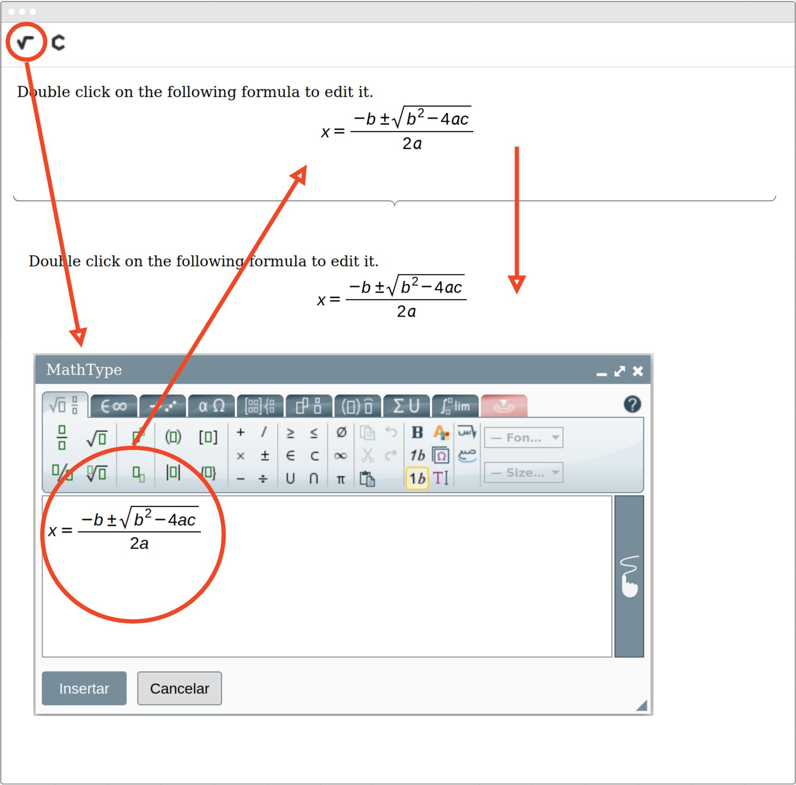
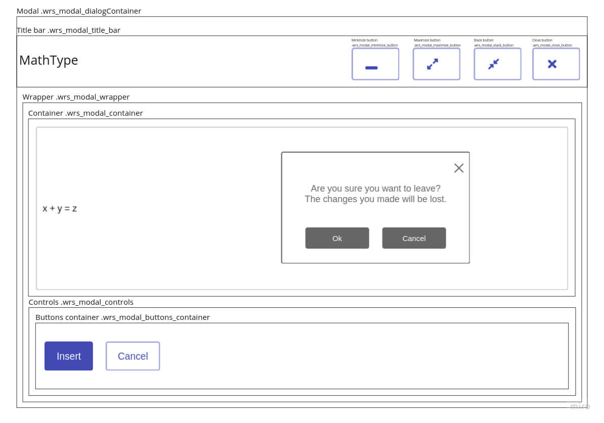

# Cypress End-to-end tests for the MathType Web Integrations

[Cypress.io](https://www.cypress.io) is an open source, MIT licensed end-to-end test runner.

**Important**: More information about testing commands and how to use instructions on the [Testing section](/docs/development/testing/README.md) of this project documentation.

## Folder structure

These folders hold end-to-end tests and supporting files for the Cypress Test Runner.

- [fixtures](fixtures) holds sample data for mocking our tests, [read more](https://on.cypress.io/fixture).
- [tests](tests) holds the actual integration test files, [read more](https://on.cypress.io/writing-and-organizing-tests)
- [plugins](plugins) allow you to customize how tests are loaded, [read more](https://on.cypress.io/plugins)
- [support](support) includes our custom commands, [read more](https://on.cypress.io/writing-and-organizing-tests#Support-file)

## What do we want to test?

A minimal MathType Integration for the web that includes mathematical formula editing & rendering features from Wiris.

### Elements

It would consist on these next HTML elements: 

1. an editable element, with a default value or not
2. a read-only element with its content synchronized to the previous element through an `onChange` event
3. the MathType and ChemType buttons, over the editable content

Also, whenever the MathType or ChemType buttons are clicked, or a mathematical expression inside the textarea is clicked, 

4. a MathType Modal Window is shown to the user to edit the formula.

### Source code

A canonical representation of the HTML source code of this app would look like this:

```html
<!-- MathType and ChemType buttons added by the plugin: -->
<mathtype-toolbar/>
<!-- An editable element integrating MathType: -->
<textarea>...</textarea>
<!-- A div with the same content as the textarea: -->
<div>...</div>
<!-- The MathType modal window:  -->
<mathtype-modal-window/>
```

### UI Preview

This next diagram represents a common E2E interaction with the MathType for the Web UI elements of the canonical MathType Integration sample app: adding a mathematical formula from scratch using the MathType editor.





### MathType Modal Window

The MathType Modal Window consists on the following elements:





> This diagram is based on a comment in the source code of [`modal.js`](/packages/mathtype-html-integration-devkit/src/modal.js) from the `mathtype-html-integration-devkit` package.

## `cypress.json` file

You can configure project options in the [../cypress.json](../cypress.json) file, see [Cypress configuration doc](https://on.cypress.io/configuration).

The current values we've set by default for all environments are:

```json
    // By default, point to the demos/html5/generic App.
    "baseUrl": "http://localhost:8007",
    // Override default 'integration' value to 'tests'
    "integrationFolder": "cypress/tests",
    "screenshotOnRunFailure": true,
    // Optimize test execution by activating Fail_fast feature everywhere.
    "env":
    {
        "FAIL_FAST_STRATEGY": "run",
        "FAIL_FAST_ENABLED": true
    }

```

The main cypress.json files will hold the default settings for all tests in all environments: local, build, ...

## More information

- [https://github.com/cypress.io/cypress](https://github.com/cypress.io/cypress)
- [https://docs.cypress.io/](https://docs.cypress.io/)
- [Writing your first Cypress test](http://on.cypress.io/intro)
